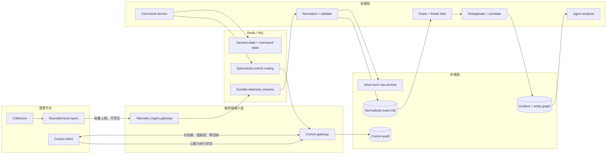

# OpenXDR 目标架构（讨论稿）

> 状态：v0.1，待共同维护。
>
> 本文描述目标架构和协议边界，暂不以当前代码实现为约束。已经确定的原则写成“必须”，尚需验证的选择写成“建议”或“待定”。

## 1. 目标

OpenXDR 需要把端点、网络、身份、云与日志证据汇入统一的数据平面，在服务端完成归一化、检测、关联和 Agent 分析，并通过独立控制平面对节点下发采集策略与响应动作。

核心目标：

1. **端受服务器控制**：采集范围、采样、临时取证和响应动作均由服务端策略决定。
2. **数据与控制分离**：数据上报允许排队和补传；控制消息强调低延迟、时效和明确回执。
3. **服务端统一接收**：端不直接连接数据库或 Redis，只连接接入网关；服务端从 MQ 消费遥测。
4. **至少一次传递，可幂等处理**：消息可能重复，但不能因此制造重复事件或重复执行响应动作。
5. **先确定性处理，后 Agent 分析**：归一化、规则、情报、去重和实体关联在前；Agent 只分析已收敛的事件上下文。
6. **积压必须可见**：服务端必须知道积压数量、最老消息年龄、消费速率、丢弃量和每个节点的本地队列状态。
7. **失联时安全退化**：节点继续执行最后一版有效采集策略；危险控制命令不得在过期后重放。

## 2. 总体架构



## 3. 两条通信信道

| 维度 | 数据上报信道 | 控制信道 |
|---|---|---|
| 内容 | 日志、进程、文件、网络流、轨迹、告警、资产清单 | 心跳、策略版本、采集规则、临时取证、响应命令、执行回执 |
| 语义 | 高吞吐、批量、允许积压和补传 | 低延迟、强时效、不可无限积压 |
| 传递 | 至少一次；服务端按 `event_id` 幂等 | 命令按 `command_id` 幂等；必须有 deadline 和状态机 |
| 断线 | 写入端侧有界 spool，重连后续传 | 重连后先对账 desired state；过期命令不重放 |
| 服务端中间件 | Redis Streams 或其他持久 MQ | 长连接 + Redis Pub/Sub 路由；状态放 Redis/DB |
| 反压 | 批量、压缩、降采样、分级丢弃 | 不排队等待；超时即失败或进入人工复核 |

### 3.1 数据上报信道

- 节点向 Ingest Gateway 建立 mTLS 连接，不能直接访问 Redis。
- 节点按批次上报，每批包含序号、首尾事件时间、压缩算法和校验值。
- 网关完成身份绑定、大小限制、基本 schema 校验后写入 MQ；只有 MQ 接收成功才向节点确认。
- 节点只删除已确认批次。本地 spool 必须有磁盘/条目上限，并按数据优先级采取降级策略。
- 服务端允许多消费者重放，但数据库写入必须以 `tenant_id + event_id` 或等价唯一键去重。

建议的端侧丢弃优先级：

1. 永不主动丢弃：控制审计、响应结果、高危检测证据、身份与进程启动事件。
2. 可聚合：重复网络流、性能计数、周期资产快照。
3. 可采样或先丢弃：高频 debug 日志、低价值周期指标、重复健康信息。

### 3.2 控制信道

- 节点主动连出到 Control Gateway，建议使用双向 gRPC stream；WebSocket/QUIC 可以作为受限网络下的替代传输。
- 控制消息不依赖“排队最终总会执行”。每条命令必须带：
  - `command_id`
  - `agent_id`
  - `kind`
  - `issued_at`
  - `deadline`
  - `policy_version`
  - `idempotency_key`
  - `payload_digest` 或签名
- 命令状态机：`created → dispatched → acknowledged → running → succeeded | failed | expired | cancelled`。
- 结束进程、隔离主机、删除文件等危险动作过期后必须失败，不能在节点重连时盲目补发。
- 采集策略采用 **desired state**：服务端保存期望版本，节点报告已应用版本；重连时比较版本并收敛，而不是重放所有历史配置消息。

## 4. Redis 是否足够

Redis 足以承载第一阶段，但应区分三种用法：

1. **Redis Streams：遥测 MQ**
   - consumer group 支持多实例消费、pending、确认和故障接管。
   - 按租户或固定分片建 stream，避免每个节点一个 stream。
   - 只有在所有必要消费者均已越过安全水位后才能 trim。
2. **Redis Pub/Sub：在线控制路由**
   - 只负责把命令送到持有节点连接的 Control Gateway 实例。
   - Pub/Sub 不保证离线送达，正好避免把过期控制消息长期积压。
3. **Redis Hash/String：状态与租约**
   - `agent -> gateway instance` 在线路由租约。
   - 节点心跳 TTL、desired policy、最新 ack、短期 command 状态。
   - 关键审计与最终结果仍应写持久数据库。

Redis 作为遥测 MQ 的成立条件：

- 打开合适的持久化和高可用配置，并验证故障恢复时间。
- 积压数据量在内存、持久化文件、复制和备份预算内保留足够余量。
- 能持续观测 stream 长度、consumer lag、pending 数、最老 pending 年龄和内存占用。
- 对慢消费者有隔离、扩容、重放和死信处理方案。

以下任一情况出现时，应把遥测平面迁往 Kafka、Pulsar 或 NATS JetStream 等独立持久 MQ；控制路由仍可保留 Redis：

- 需要多天以上的大规模回放或长时间断流积压。
- 消费者种类显著增加，且各自需要独立保留位置。
- Redis 内存与持久化成本高于专用日志型 MQ。
- 需要跨地域复制、严格分区顺序或更强的不可变日志语义。

## 5. 节点状态与积压观测

节点通过控制信道周期上报轻量心跳，不把心跳混入遥测大队列。建议字段：

| 分类 | 字段示例 |
|---|---|
| 身份 | `tenant_id`、`agent_id`、证书序列号、hostname、boot_id |
| 版本 | agent 版本、collector 版本、OS/内核、当前策略版本 |
| 控制 | 连接建立时间、最后控制 RTT、最后命令 ID/结果 |
| 遥测 | 最后生成序号、最后确认序号、本地 spool 条数/字节、最老事件年龄 |
| 丢失 | 按数据类型统计 dropped、sampled、coalesced 数量 |
| 健康 | collector 状态、CPU、内存、磁盘、权限缺失、时间偏差 |

服务端同时计算：

- MQ backlog 条数与估算字节数。
- oldest unconsumed age，而不只看队列长度。
- 每个 consumer group 的 ingest rate、consume rate、lag 和 pending。
- 每租户、每分片、每数据类型的热点。
- 节点本地未确认量与服务端 MQ lag 的差异，用于判断堵塞发生在端、网络、网关还是消费者。

建议状态：

- `online`：心跳正常，控制可达。
- `degraded`：仍在线，但采集器失败、策略未收敛、spool 持续增长或时间偏差过大。
- `backlogged`：最老未确认遥测超过阈值。
- `offline`：心跳 TTL 过期。
- `quarantined`：节点被隔离但控制保活通道仍可达。

## 6. 消息数据契约

### 6.1 遥测信封

所有数据类型共享最小信封，原生字段放在 `raw`，归一化字段写入 `data`：

```json
{
  "schema_version": "1.0",
  "event_id": "uuid-or-content-derived-id",
  "tenant_id": "tenant-id",
  "agent_id": "agent-id",
  "asset_id": "stable-asset-id",
  "boot_id": "host-boot-id",
  "sequence": 123456,
  "event_type": "process.start",
  "event_time": "2026-08-08T12:00:00.000Z",
  "observed_time": "2026-08-08T12:00:00.120Z",
  "ingested_time": "2026-08-08T12:00:00.300Z",
  "priority": "high",
  "data": {},
  "raw": {},
  "labels": {}
}
```

约束：

- `event_time` 是事件发生时间，`observed_time` 是采集器看到时间，`ingested_time` 只能由服务端写入。
- `asset_id` 必须稳定，不能只依赖 hostname 或临时 IP。
- 高基数字段必须受长度、数量和嵌套深度限制。
- schema 必须版本化；消费者至少兼容当前版和上一版。
- 大对象、文件样本、PCAP、内存转储写对象存储，事件只保留哈希、大小、类型和受控引用。

### 6.2 控制信封

```json
{
  "protocol_version": "1.0",
  "command_id": "uuid",
  "agent_id": "agent-id",
  "kind": "policy.apply",
  "issued_at": "2026-08-08T12:00:00Z",
  "deadline": "2026-08-08T12:05:00Z",
  "policy_version": 42,
  "idempotency_key": "agent-id:policy:42",
  "payload": {},
  "signature": "..."
}
```

## 7. 服务端处理链

1. **接入**：鉴权、限流、批次校验、解压、写 MQ。
2. **归一化**：字段映射、时间修正、资产解析、进程/用户/网络实体生成。
3. **质量检查**：schema 错误、未知枚举、过大字段和时间漂移进入隔离队列，不能悄悄丢失。
4. **原始留存**：短期保存可重放原始信封；敏感或超大载荷单独存对象存储。
5. **规范化入库**：保存可检索事件与实体引用，写入操作必须幂等。
6. **检测**：规则、行为基线、威胁情报和安全产品原生告警统一生成 detection finding。
7. **降噪**：指纹去重、已知噪声抑制、同实体时间窗聚合。
8. **关联**：按资产、用户、进程血缘、文件哈希、域名/IP、会话和云资源建立 incident graph。
9. **Agent 分析**：只接收有边界的 IncidentContext；工具调用用于补证，不允许直接生成任意 SQL。
10. **自动处置**：按置信度、资产等级、白名单和审批策略生成控制命令，所有动作可审计和撤销。

## 8. XDR 应采集的信息种类

### P0：第一阶段必须具备

| 类别 | 关键数据 | 主要用途 |
|---|---|---|
| 资产与节点健康 | 硬件/OS、稳定资产 ID、网络接口、agent/策略版本、collector 状态 | 资产归属、数据质量、失联与积压判断 |
| 进程与执行 | start/exit、命令行、cwd、用户、父子进程、签名、文件哈希、容器信息 | 进程树、执行链、恶意工具与 LOLBin 检测 |
| 身份与认证 | 登录成功/失败、会话、提权、sudo/UAC、账号/组变化、MFA 结果 | 爆破、凭证滥用、异常登录、权限提升 |
| 文件与持久化 | create/write/rename/delete、关键目录、启动项、服务、计划任务、注册表、SSH key | 落地、持久化、篡改与勒索行为 |
| 网络连接 | 五元组、方向、进程关联、字节/包、连接状态、NAT/代理上下文 | C2、横向移动、异常外连、数据外传 |
| DNS/TLS/HTTP 元数据 | query/answer、SNI、证书、JA4/等价指纹、HTTP host/method/status/user-agent | 域名情报、加密流量识别、隧道与恶意基础设施 |
| 系统与安全日志 | Windows Event、Linux auth/audit、syslog、安全设备原生告警 | 补齐端点、身份、网络和设备证据 |
| 控制与响应审计 | 策略变更、命令下发、ack、执行结果、操作者、审批链 | 防止控制面黑盒和危险动作失控 |

### P1：形成完整 XDR 覆盖

| 类别 | 关键数据 | 主要用途 |
|---|---|---|
| 软件、漏洞与安全态势 | 软件清单、补丁、CVE、暴露服务、关键配置、磁盘加密/防护状态 | 风险优先级、攻击面与暴露面关联 |
| 云控制面 | IAM、API 审计、对象存储、密钥、网络安全组、实例/函数生命周期 | 云账号滥用、公开暴露、持久化与横向移动 |
| 容器与 Kubernetes | image/digest、pod/workload、exec、RBAC、admission、audit log | 容器逃逸、供应链、集群权限滥用 |
| 邮件与协作 | 发件人、收件人、URL/附件哈希、投递/点击、OAuth 授权 | 钓鱼入口、账号接管、恶意附件关联 |
| SaaS 与应用审计 | 管理操作、令牌、API 调用、关键业务对象变化 | 第三方账号滥用和数据访问异常 |
| 数据库与数据访问 | 登录、查询摘要、导出、权限变化、异常访问量 | 内部威胁、凭证滥用、数据外泄 |
| 防护设备与检测产品 | EDR/NDR/IDS/IPS/WAF/Firewall/CASB/DLP findings | 汇总异构检测，保留供应商上下文 |
| 威胁情报与环境上下文 | IOC、信誉、资产等级、业务负责人、暴露面、维护窗口 | 命中增强、优先级与误报抑制 |

### P2：按需取证，不建议默认全量采集

- PCAP、HTTP body、邮件正文、完整脚本内容。
- 进程内存、内核转储、磁盘镜像、浏览器历史等高敏感数据。
- 高频系统调用或全量文件读事件。
- 长时间屏幕、键盘、剪贴板等强隐私数据。

P2 数据应由短时、显式、可审计的控制命令开启，并带范围、时限、审批和自动清理策略。

## 9. 存储与保留

- **原始层**：短期、不可变、可重放；用于修复归一化错误和审计数据损失。
- **规范化事件层**：面向检索和检测，按时间与租户分区。
- **实体与关联层**：资产、用户、进程、文件、网络端点、云资源及它们的时序边。
- **Incident 层**：finding、证据引用、攻击链、研判、处置和审计。
- **大对象层**：对象存储保存样本、PCAP、dump；数据库仅保存内容寻址引用。

保留策略必须按数据类别、租户与敏感度配置；“保留多久”与“可检索多久”分开。删除流程同时覆盖数据库、对象存储、备份索引和 Agent 分析缓存。

## 10. 安全边界

- 节点与网关使用 mTLS，证书身份绑定 `tenant_id + agent_id`，支持吊销和轮换。
- 端不接受来自任意服务实例的裸命令；命令需要服务端签名、deadline 和防重放字段。
- 控制网关只路由，不直接决定策略；Command Service 负责授权、审批、签名和审计。
- 管理端 RBAC 至少区分查看、狩猎、策略管理、响应操作和平台管理。
- 租户过滤必须在应用层强制执行，不能依赖调用者自觉传入正确条件。
- Agent 分析所见内容视为不可信输入；日志、脚本、邮件和命令行中的提示不得改变系统权限。
- 所有自动响应必须具备 dry-run、白名单、最大影响范围和人工熔断开关。

## 11. 失败场景与预期行为

| 故障 | 预期行为 |
|---|---|
| 节点断网 | 遥测进入有界 spool；继续最后有效策略；记录丢弃/聚合计数 |
| Ingest Gateway 故障 | 节点重连其他实例；未获 MQ ack 的批次重发 |
| MQ 积压 | 扩消费者；显示 lag/oldest age；按租户和优先级限流，禁止静默丢弃 |
| Normalizer poison message | 进入隔离/死信队列，保留错误原因与原始引用 |
| Control Gateway 故障 | 连接租约过期，节点重连；desired state 重新对账 |
| Redis Pub/Sub 丢消息 | 命令状态仍在 Redis/DB；服务端可判断未 ack，但过期命令不自动重放 |
| 数据库故障 | 消费者停止 ack，消息留在 MQ；恢复后幂等续写 |
| 时钟漂移 | 心跳标记 degraded；同时保留事件时间与服务端观测时间 |
| 重复命令 | 节点按 idempotency key 返回已有结果，不再次执行 |

## 12. 分阶段落地建议

### Phase 1：协议和可观测性先行

- 定义遥测/控制信封、版本兼容规则、命令状态机。
- 建立 Ingest Gateway、Control Gateway 和 mTLS 身份。
- Redis Streams 承载遥测，Pub/Sub + desired state 承载控制。
- 打通 backlog、heartbeat、policy version、command ack 仪表盘。
- 优先接入 P0 数据，并完成归一化幂等测试。

### Phase 2：检测与关联

- 规则、情报、去重、抑制统一 finding 模型。
- 建立资产、用户、进程、文件和网络实体图。
- 将 IncidentContext 作为 Agent 分析唯一入口。
- 建立原始事件重放和归一化版本迁移流程。

### Phase 3：自动响应与规模化

- 上线审批、dry-run、白名单、撤销和自动熔断。
- 压测 Redis backlog、故障恢复、消费者扩缩容和多租户隔离。
- 根据实测积压、保留与回放需求决定是否迁移专用 MQ。
- 扩展 P1 数据源和跨云、容器、邮件/SaaS 关联。

## 13. 需要共同确认的问题

1. 第一阶段规模：节点数、平均/峰值 EPS、单事件平均大小、允许补传时长。
2. 控制命令的延迟目标、离线语义，以及哪些命令允许重试。
3. Redis 的部署形态、可用内存、持久化、HA、备份与故障恢复目标。
4. 原始数据、规范化事件、incident 和大对象各自的保留期。
5. 第一阶段 P0 数据在 Windows、Linux、macOS、云和网络设备之间的优先级。
6. 统一 schema 采用 OCSF 的范围：完整兼容、子集，还是内部模型加 OCSF 映射层。
7. Agent 分析的模型部署、租户隔离、上下文上限和人工审批边界。
8. 自动响应首批支持哪些动作，以及默认 dry-run/白名单策略。
